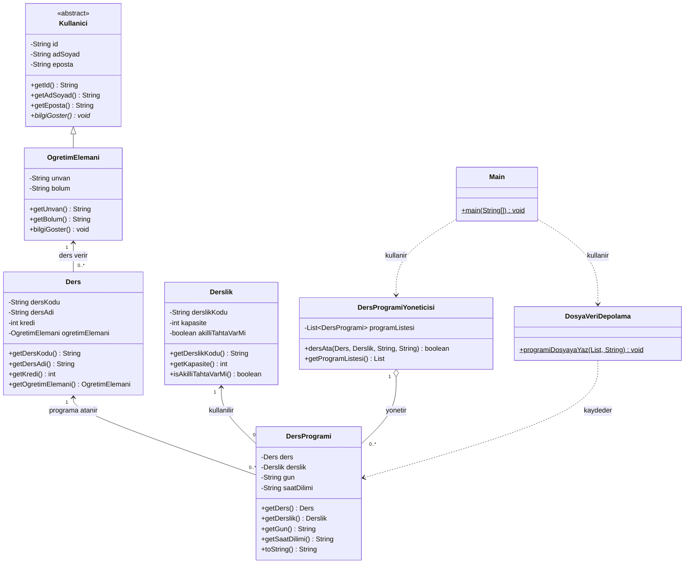

# UML Sınıf Diyagramı

Akıllı Kampüs Ders Programı projesinde bulunan
sınıfların ve aralarındaki ilişkilerin gösterimi.

```mermaid
classDiagram
    class Kullanici {
        <<abstract>>
        -String id
        -String adSoyad
        -String eposta
        +getId() String
        +getAdSoyad() String
        +getEposta() String
        +bilgiGoster()* void
    }

    class OgretimElemani {
        -String unvan
        -String bolum
        +getUnvan() String
        +getBolum() String
        +bilgiGoster() void
    }

    class Ders {
        -String dersKodu
        -String dersAdi
        -int kredi
        -OgretimElemani ogretimElemani
        +getDersKodu() String
        +getDersAdi() String
        +getKredi() int
        +getOgretimElemani() OgretimElemani
    }

    class Derslik {
        -String derslikKodu
        -int kapasite
        -boolean akilliTahtaVarMi
        +getDerslikKodu() String
        +getKapasite() int
        +isAkilliTahtaVarMi() boolean
    }

    class DersProgrami {
        -Ders ders
        -Derslik derslik
        -String gun
        -String saatDilimi
        +getDers() Ders
        +getDerslik() Derslik
        +getGun() String
        +getSaatDilimi() String
        +toString() String
    }

    class DersProgramiYoneticisi {
        -List~DersProgrami~ programListesi
        +dersAta(Ders, Derslik, String, String) boolean
        +getProgramListesi() List
    }

    class DosyaVeriDepolama {
        +programiDosyayaYaz(List, String)$ void
    }

    class Main {
        +main(String[])$ void
    }

    Kullanici <|-- OgretimElemani
    OgretimElemani "1" <-- "0..*" Ders : ders verir
    Ders "1" <-- "0..*" DersProgrami : programa atanir
    Derslik "1" <-- "0..*" DersProgrami : kullanilir
    DersProgramiYoneticisi "1" o-- "0..*" DersProgrami : yonetir
    DosyaVeriDepolama ..> DersProgrami : kaydeder
    Main ..> DersProgramiYoneticisi : kullanir
    Main ..> DosyaVeriDepolama : kullanir
```
